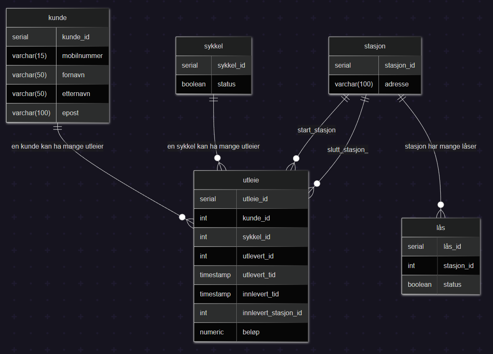
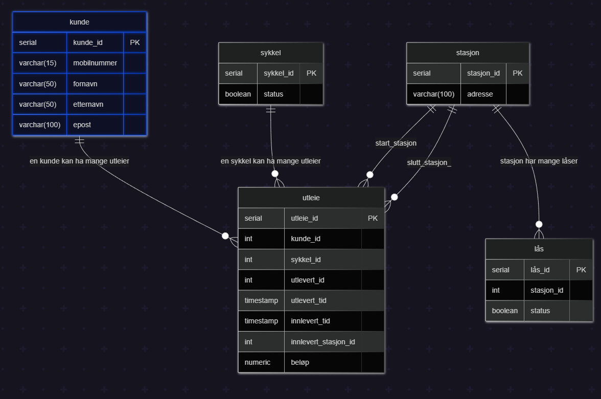
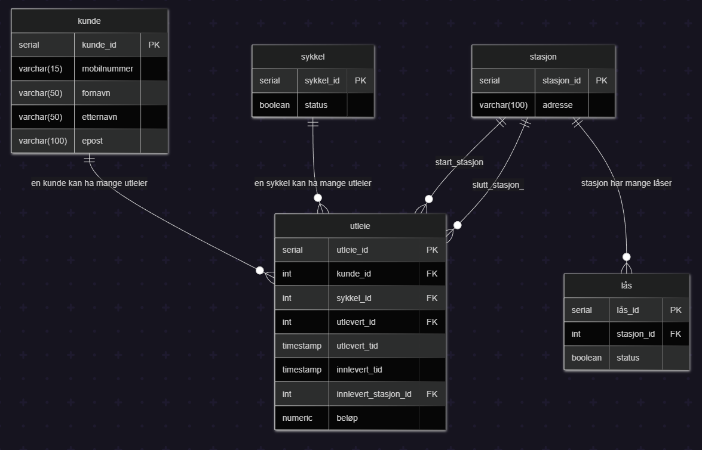
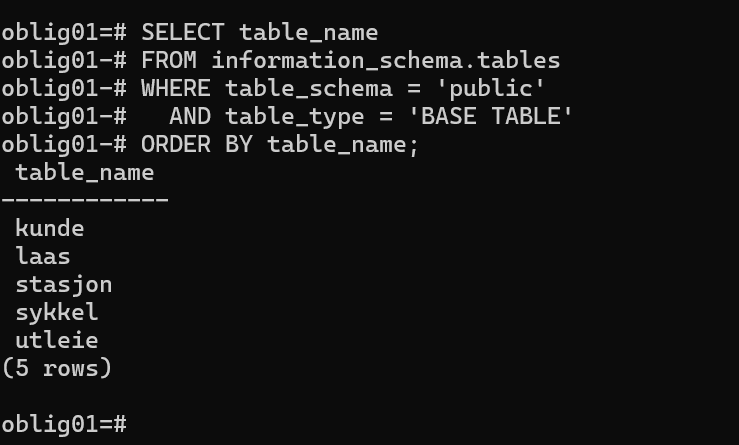

# Besvarelse - Refleksjon og Analyse

**Student:** Brede Overhalden

**Studentnummer:** brove3385

**Dato:** 01.03.26

---

## Del 1: Datamodellering

### Oppgave 1.1: Entiteter og attributter

**Identifiserte entiteter:**

Kunde, sykkel, stasjon, lås og utleie

**Attributter for hver entitet:**

Kunde: kunde_id, mobilnummmer, fornavn, etternavn og epost

Sykkel: sykkel_id, status

Stasjon: stasjon_id, adresse

Lås: lås_id, stasjon_id, status

Utleie: utleie_id, kunde_id, sykkel_id, utlevert_id, utlevert_tid, innlevert_tid, innlevert_stasjon_id, beløp

---

### Oppgave 1.2: Datatyper og `CHECK`-constraints

**Valgte datatyper og begrunnelser:**

`Kunde:`
SERIAL kunde_id, varchar(15) mobilnummer, varchar(50) fornavn, varchar(50) etternavn, varchar(100) epost.
Jeg har brukt varchar fordi teksten varierer i lengde fra kunde til kunde og SERIAL for kudne_id slik at den genereres automatisk
av databasen, dette reduserer risiko for duplikater.

`Sykkel:`
SERIAL sykkel_id, boolean status. Jeg har valgt SERIAL for sykkel_id slik at den genereres automatisk
av databasen, dette reduserer risiko for duplikater. Bruker boolean for status på sykkel fordi vi kun trenger to tilstander tilgjengelig (true) og ikke tilgjenglig (false)

`Stasjon:`
SERIAL stasjon_id, varchar(100) adresse. Jeg har brukt SERIAL for stasjon_id slik at den genereres automatisk
av databasen, dette reduserer risiko for duplikater. Bruker varchar for adresse fordi lengden varierer og feltet er tekst

`Lås:`
SERIAL lås_id, int stasjon_id, boolean status. Jeg har brukt SERIAL for lås_id slik at den genereres automatisk
av databasen, dette reduserer risiko for duplikater. Bruker int for stasjon_id da dette er en fremmenøkkel som peker stasjon_id.
Bruker boolean for status fordi vi kun trenger to tilstander låst (true) og åpen/ulåst (false)

`Utleie:`
SERIAL utleie_id, int kunde_id, int sykkel_id, int utlevert_id, timestamp utlevert_tid
timestamp innlevert_tid, int innlevert_stasjon_id, numeric(10,2) beløp.
Bruker SERIAL for utleie_id slik at den genereres automatisk av databasen, dette reduserer risiko for duplikater. Bruker int for de andre ID-ene da de peker på sine tilsvarende ID-er i andre tabeller.
Timestamp egner seg bra for utlevert tid og innlevert tid fordi vi må måle tidsintervallet. Bruker numeric for beløp de dette gir presise bereginger av tall
satt 10 for totalt antall siffer og 2 for antall siffer etter komma. Numeric hindrer avrundingsfeil som kan skje ved bruk av float f.eks.

**`CHECK`-constraints:**
```
Kunde:
CHECK (mobilnummer ~ '^[0-9]{8,15}$') //Sikrer at mobilnummeret betår av kun tall og ikke er for kort/langt
CHECK (length(trim(fornavn)) > 0) //Hindrer at man lagrer tomme navn eller navn med bare mellomrom
CHECK (length(trim(etternavn)) > 0) //Hindrer at man lagrer tomme navn eller navn med bare mellomrom
CHECK (epost ~* '^[A-Z0-9._%+-]+@[A-Z0-9.-]+\.[A-Z]{2,}$') //Sikrer standard x@y.z epost format
```
```
Stasjon:
CHECK (length(trim(sted)) > 0) // Hindrer at stasjonen registreres uten adresse
```
```
Utleie:
CHECK (beløp IS NULL OR beløp >= 0) //Sikrer at beløpet ikke kan være negativ og NULL tillates før utleien er avsluttet
CHECK (innlevert_tid IS NULL OR innlevert_tid >= utlevert_tid) //Sikrer at en sykkel ikke leveres før den er hentet og NULL tilates så lenge det er aktivt utleie
CHECK (
  (innlevert_tid IS NULL AND innlevert_stasjon_id IS NULL)
  OR
  (innlevert_tid IS NOT NULL AND innlevert_stasjon_id IS NOT NULL)
) // Dette sikrer mot halvferdige utleier. Begge ID-er må enten være NULL eller satt 

```

**ER-diagram:**


---

### Oppgave 1.3: Primærnøkler

**Valgte primærnøkler og begrunnelser:**

Kunde:
Jeg har valgt å bruke en kunstig intern nøkkel som identifiserer hver kunde unikt. Mobilnummer og epost kan
endres over tid og er derfor ikke gunstige. En intern ID er derfor stabil og mer effektiv å bruke i relasjoner
fremmednøkler og spørringer

Sykkel:
Hver sykkel har en unik ID i systemet som nevnt i case beskivelsen. ```sykkel_id``` gjør det mulig å spore en spesifikk 
sykkel. Det gjør at vi kan se på utleier og historikk uavhengig av hvem som bruker den eller hvor den står.

Stasjon:
Stasjon trenger en unik identifikator for å kunne koble til låser og utleier. Addressen kan endres så en unik ID gir en
stabil og entydig nøkkel.

Lås:
Hver lås er et eget fysisk punkt på en satsjon og må kunne identifiseres unikt. ```lås_id``` brukes for å knytte låsen
til en bestemt stasjon ```stasjon_id```.

Utleie:
En utleie er en leieperiode, samme kunde kan leie samme sykkel mange ganger. Derfor trenger vi en unik ID for hver leie.
Med ```utleie_id``` kan vi referere til en spesifikk utleie.

**Naturlige vs. surrogatnøkler:**

I denne oppgaven har jeg valgt å bruke surrogatnøkler som primærnøkler for alle entiteter. Forskjellen mellom naturlig nøkkel
surrogatnøkkel er med en naturlig nøkkel så så bruker man en nøkkel som allerede finnes naturlig i dataene som f.eks. mobilnummer, 
epost, adresse osv. Med en surrogatnøkkel så bruker man en kunstig genereret ID som kun brukes for å identifisere rader i databasen.
Hvorfor har jeg valgt å bruke surrogatnøkler, det er fordi de gir stabilitet naturlige nøkler kan endres. En kunde kan bytte
mobilnummer, endre epost eller en stasjon kan endre adresse. En primærnøkkel bør helst aldri endres og det er derfor tryggere
med surrogatnøkler. Det gir også fleksibilitet hvis en kunde skulle ha flere eposter, flere mobilnummer eller stasjonen endrer
lokasjon da slipper vi å måtte endre på hele nøkkelstrukturen


**Oppdatert ER-diagram:**


---

### Oppgave 1.4: Forhold og fremmednøkler

**Identifiserte forhold og kardinalitet:**

Kunde - utleie:
```kunde ||--o{ utleie``` En kunde kan leie flere sykler over tid. Hvert utleie tilhører nøyaktig en kunde.

Sykkel - utleie:
```sykkel ||--o{ utleie``` En sykkel kan leies mange ganger over tid.. Hver utleie gjelder nøyaktig en sykkel.

Stasjon - utleie (start):
```stasjon ||--o{ utleie``` Utleie starter på en stasjon. Hver utleie starter på nøyaktig en stasjon.

Stasjon - utleie (slutt):
```stasjon ||--o{ utleie``` En utleie avsluttes på en stasjon. Hver utleie avsluttes på nøyaktig en stasjon.


**Fremmednøkler:**

I tabellen ```utleie``` har jeg følgende fremmednøkler:

``kunde_id`` REFERENCES ```kunde(kunde_id)```. Dette kobler hver utleie til en spesifikk kunde. Dette implementerer forholdet
en kunde kan ha mange utleier, men hver utleie tilhører bare en kunde.

``sykkel_id`` REFERENCES ``sykkel(sykkel_id``. Da kobler man hver utleie til en sykkel. Dette implementerer forholdet en sykkel
kan ha mange utleier over tid.

``utlevert_stasjon_id `` REFERENCES ``stasjon(stasjon_id)``. Dette kobler utleien til stasjonen der den startet. Her implementerer
man forhldet for stasjon - utleie for startstasjon.

``innlevert_stasjon_id `` REFERENCES ``stasjon_id(stasjon_id)``. Her kobler man utleien til stasjonen der den avsluttes. Denne kan
være NULL mens utleien er aktiv, og implementerer dermed at sluttstasjonen registreres først ved innlevering.

I tabellen ``lås``:

``stasjon_id`` REFERENCES ``stasjon(stasjon_id)``. Her kobler man hver lås til en stasjon. Dette implementerer forholdet en
stasjon kan ha mange låser, men en lås tilhører bare en stasjon

**Oppdatert ER-diagram:**



---

### Oppgave 1.5: Normalisering

**Vurdering av 1. normalform (1NF):**

Datamodellen min tilfredsstiller kravene som for å oppfylle 1NF. Datamodellen inneholder kun atomære verdier,
alle verdiene i tabellen består kun av enkle datatyper som ``serial, int, varchar, boolean, timestamp og numeric``. Det er
ingen sammensatte verdier, jeg har f.eks skilt mellom fornavn og etternavn. Det er heller ingen flerverdiattributter
datamodellen inneholder ingen lister eller flere verdier i samme celle. Datamodellen opprettholder også ingen relasjoner
i relasjoner (nøstede tabeller), datamodellen er flat jeg har f.eks. splittet opp lås og stasjon i egne tabeller. Jeg knytter
de sammen med en fremmednøkkel ``stasjon_id`` i tabellen lås isteden for at de skulle vært i samme tabell.

**Vurdering av 2. normalform (2NF):**

For at en modell skal være på 2NF, må to krav være oppfylt:
1. Den må allerede tilfredsstille 1NF (noe denne modellen gjør).
2. Hvert ikke-primattributt (attributter som ikke er en del av primærnøkkelen) må være fullt funksjonelt avhengig av hele primærnøkkelen

Datamodellen min så har alle tabellene enkle primærnøkler, nøkler bestående av kun en kolonne. Tabellen kunde har ```kunde_id```
som primærnøkkel, alle andre data om kunden er avhengige av denne ID-en. sykkel har ``sykkel_id``som primærnøkkel
og ``status`` er direkte knyttet til den spesifikke sykkelen. stasjon har ``stasjon_id`` som primærnøkkel og ``addresse``
er knyttet til denne ID-en. lås har ```lås_id``` som primærnøkkel. ``stasjon_id`` og ``status`` er avhengige av den spesifikke
lås ID-en. utleie har ``utleie_id`` som primærnøkkel. Alle andre attributter som ``beløp``,``utlevert_tid``,``innlevert_tid`` og 
fremmednøklene er avhengig av denne ene utleie ID-en.

**Vurdering av 3. normalform (3NF):**

Den tredje normalformen bygger på konseptet om transitiv avhengighet. For at datamodellen skal oppfylle 3NF så må den
oppfylle:
1. Den må oppfylle 2NF noe vi har allerede fastslått at datamoddellen gjør
2. Det må ikke finnes noen transitive avhengigheter mellom ikke primattributter, det betyr en kolonne som ikke er en del av nøkkelen
kun skal være avhengig av primærnøkkelen, og ikke av andre ikke-primattributter

I datamodellen min så har de ulike tabellene ingen slike transitive avhengigheter og oppfyller 3NF fordi:
1. ``kunde:`` ``mobilnummer, fornavn, etternavn og epost`` er alle direkte egenskaper ved kunden. Ingen av disse bestemmer
logisk sett verdien til andre f.eks. etternavn bestemmer ikke hvileken epost man har.
2. ``stasjon:`` innholder kun ``satsjon_id og addresse``. Siden det bare er ett ikke primattributt (addresse), 
er det umulig å ha transitiv avhengighet her
3. ``utleie:`` Her lagres selve informasjonen om utleieforholdet. Attributter som ``beløp, utlevert_tid og innlevert_tid``
er alle direkte avhengige av den spesifikke utleie ID-en (utleie_id). Det er ingen avhengigheter mellom f.eks ``beløp og utlevert_stasjon_id``
4. ``sykkel og lås`` Disse tabellene har kun enkle attributter som ``status`` som er direkte knyttet til deres primærnøkler.

**Eventuelle justeringer:**

Modellen var på 3NF og ingen justeringer krevdes.

---

## Del 2: Database-implementering

### Oppgave 2.1: SQL-skript for database-initialisering

**Plassering av SQL-skript:**

Bekrefter at jeg har lagt inn SQL-skriptet i `init-scripts/01-init-database.sql`

**Antall testdata:**

- Kunder: 5
- Sykler: 100
- Sykkelstasjoner: 5
- Låser: 100
- Utleier: 50

---

### Oppgave 2.2: Kjøre initialiseringsskriptet

**Dokumentasjon av vellykket kjøring:**

```
PS C:\Users\brede\Documents\2.semester\DATA1500\oblig1\data1500-oblig-01> docker-compose up
[+] up 3/3
 ✔ Network data1500-oblig-01_data1500-network     Created                                                           0.1s
 ✔ Volume data1500-oblig-01_postgres_data_oblig_1 Created                                                           0.0s
 ✔ Container data1500-postgres                    Created                                                           0.4s
Attaching to data1500-postgres
data1500-postgres  | The files belonging to this database system will be owned by user "postgres".
data1500-postgres  | This user must also own the server process.
data1500-postgres  |
data1500-postgres  | The database cluster will be initialized with locale "en_US.utf8".
data1500-postgres  | The default database encoding has accordingly been set to "UTF8".
data1500-postgres  | The default text search configuration will be set to "english".
data1500-postgres  |
data1500-postgres  | Data page checksums are disabled.
data1500-postgres  |
data1500-postgres  | fixing permissions on existing directory /var/lib/postgresql/data/pgdata ... ok
data1500-postgres  | creating subdirectories ... ok
data1500-postgres  | selecting dynamic shared memory implementation ... posix
data1500-postgres  | selecting default max_connections ... 100
data1500-postgres  | selecting default shared_buffers ... 128MB
data1500-postgres  | selecting default time zone ... UTC
data1500-postgres  | creating configuration files ... ok
data1500-postgres  | running bootstrap script ... ok
data1500-postgres  | sh: locale: not found
data1500-postgres  | 2026-02-25 12:08:30.490 UTC [37] WARNING:  no usable system locales were found
data1500-postgres  | performing post-bootstrap initialization ... ok
data1500-postgres  | syncing data to disk ... ok
data1500-postgres  |
data1500-postgres  |
data1500-postgres  | Success. You can now start the database server using:
data1500-postgres  |
data1500-postgres  |     pg_ctl -D /var/lib/postgresql/data/pgdata -l logfile start
data1500-postgres  |
data1500-postgres  | initdb: warning: enabling "trust" authentication for local connections
data1500-postgres  | initdb: hint: You can change this by editing pg_hba.conf or using the option -A, or --auth-local and --auth-host, the next time you run initdb.
data1500-postgres  | waiting for server to start....2026-02-25 12:08:32.500 UTC [43] LOG:  starting PostgreSQL 15.15 on x86_64-pc-linux-musl, compiled by gcc (Alpine 15.2.0) 15.2.0, 64-bit
data1500-postgres  | 2026-02-25 12:08:32.505 UTC [43] LOG:  listening on Unix socket "/var/run/postgresql/.s.PGSQL.5432"
data1500-postgres  | 2026-02-25 12:08:32.527 UTC [46] LOG:  database system was shut down at 2026-02-25 12:08:31 UTC
data1500-postgres  | 2026-02-25 12:08:32.544 UTC [43] LOG:  database system is ready to accept connections
data1500-postgres  |  done
data1500-postgres  | server started
data1500-postgres  | CREATE DATABASE
data1500-postgres  |
data1500-postgres  |
data1500-postgres  | /usr/local/bin/docker-entrypoint.sh: running /docker-entrypoint-initdb.d/01-init-database.sql
data1500-postgres  | psql:/docker-entrypoint-initdb.d/01-init-database.sql:7: NOTICE:  table "utleie" does not exist, skipping
data1500-postgres  | DROP TABLE
data1500-postgres  | DROP TABLE
data1500-postgres  | psql:/docker-entrypoint-initdb.d/01-init-database.sql:8: NOTICE:  table "laas" does not exist, skipping
data1500-postgres  | DROP TABLE
data1500-postgres  | psql:/docker-entrypoint-initdb.d/01-init-database.sql:9: NOTICE:  table "sykkel" does not exist, skipping
data1500-postgres  | DROP TABLE
data1500-postgres  | psql:/docker-entrypoint-initdb.d/01-init-database.sql:10: NOTICE:  table "stasjon" does not exist, skipping
data1500-postgres  | psql:/docker-entrypoint-initdb.d/01-init-database.sql:11: NOTICE:  table "kunde" does not exist, skipping
data1500-postgres  | DROP TABLE
data1500-postgres  | CREATE TABLE
data1500-postgres  | CREATE TABLE
data1500-postgres  | CREATE TABLE
data1500-postgres  | CREATE TABLE
data1500-postgres  | CREATE TABLE
data1500-postgres  | INSERT 0 5
data1500-postgres  | INSERT 0 100
data1500-postgres  | INSERT 0 5
data1500-postgres  | INSERT 0 100
data1500-postgres  | INSERT 0 50
data1500-postgres  |          status
data1500-postgres  | ------------------------
data1500-postgres  |  Database initialisert!
data1500-postgres  | (1 row)
data1500-postgres  |
data1500-postgres  |
data1500-postgres  |
data1500-postgres  | waiting for server to shut down...2026-02-25 12:08:33.114 UTC [43] LOG:  received fast shutdown request
data1500-postgres  | .2026-02-25 12:08:33.119 UTC [43] LOG:  aborting any active transactions
data1500-postgres  | 2026-02-25 12:08:33.126 UTC [43] LOG:  background worker "logical replication launcher" (PID 49) exited with exit code 1
data1500-postgres  | 2026-02-25 12:08:33.130 UTC [44] LOG:  shutting down
data1500-postgres  | 2026-02-25 12:08:33.137 UTC [44] LOG:  checkpoint starting: shutdown immediate
data1500-postgres  | 2026-02-25 12:08:33.410 UTC [44] LOG:  checkpoint complete: wrote 959 buffers (5.9%); 0 WAL file(s) added, 0 removed, 0 recycled; write=0.058 s, sync=0.196 s, total=0.280 s; sync files=320, longest=0.007 s, average=0.001 s; distance=4395 kB, estimate=4395 kB
data1500-postgres  | 2026-02-25 12:08:33.438 UTC [43] LOG:  database system is shut down
data1500-postgres  |  done
data1500-postgres  | server stopped
data1500-postgres  |
data1500-postgres  | PostgreSQL init process complete; ready for start up.
data1500-postgres  |
data1500-postgres  | 2026-02-25 12:08:33.594 UTC [1] LOG:  starting PostgreSQL 15.15 on x86_64-pc-linux-musl, compiled by gcc (Alpine 15.2.0) 15.2.0, 64-bit
data1500-postgres  | 2026-02-25 12:08:33.594 UTC [1] LOG:  listening on IPv4 address "0.0.0.0", port 5432
data1500-postgres  | 2026-02-25 12:08:33.594 UTC [1] LOG:  listening on IPv6 address "::", port 5432
data1500-postgres  | 2026-02-25 12:08:33.604 UTC [1] LOG:  listening on Unix socket "/var/run/postgresql/.s.PGSQL.5432"
data1500-postgres  | 2026-02-25 12:08:33.620 UTC [61] LOG:  database system was shut down at 2026-02-25 12:08:33 UTC
data1500-postgres  | 2026-02-25 12:08:33.641 UTC [1] LOG:  database system is ready to accept connections
data1500-postgres  | 2026-02-25 12:13:33.657 UTC [59] LOG:  checkpoint starting: time
data1500-postgres  | 2026-02-25 12:13:37.753 UTC [59] LOG:  checkpoint complete: wrote 43 buffers (0.3%); 0 WAL file(s) added, 0 removed, 0 recycled; write=4.036 s, sync=0.029 s, total=4.108 s; sync files=17, longest=0.017 s, average=0.002 s; distance=173 kB, estimate=173 kB
data1500-postgres  | 2026-02-25 12:16:29.343 UTC [430] FATAL:  role "postgres" does not exist

```

**Spørring mot systemkatalogen:**

```sql
SELECT table_name 
FROM information_schema.tables 
WHERE table_schema = 'public' 
  AND table_type = 'BASE TABLE'
ORDER BY table_name;
```

**Resultat:**



---

## Del 3: Tilgangskontroll

### Oppgave 3.1: Roller og brukere

**SQL for å opprette rolle:**

```sql
CREATE ROLE kunde;
```

**SQL for å opprette bruker:**

```sql
CREATE USER kunde_1 WITH PASSWORD 'kunde123';
GRANT kunde TO kunde_1;
```
**SQL for å tildele rettigheter:**

```sql
GRANT USAGE ON SCHEMA public TO kunde;

GRANT SELECT ON TABLE
    kunde,
    sykkel,
    stasjon,
    laas,
    utleie
TO kunde;

```

---

### Oppgave 3.2: Begrenset visning for kunder

**SQL for VIEW:**

```sql
--VIEW
CREATE VIEW mine_utleier AS
SELECT u.*
FROM utleie u
         JOIN kunde k on u.kunde_id = k.kunde_id
WHERE k.epost = CURRENT_USER;

--GRANT/REWOKE
GRANT SELECT ON mine_utleier TO kunde;
```

**Ulempe med VIEW vs. POLICIES:**

En view er kun en lagret SELECT-spørring og man får ikke rad nivå sikkerhet.
Her kan en bruker i verste fall få direkte tilgang til tabellen og kan unngå view-en.
En POLICY derimot håndheves direkte på tabellene og gjelder for alle operasjoner som SELECT, INSERT, UPDATE og DELETE.
POLICY gir derfor en mer robust og sikker autorisasjonsmekanisme.

---

## Del 4: Analyse og Refleksjon

### Oppgave 4.1: Lagringskapasitet

**Gitte tall for utleierate:**

- Høysesong (mai-september): 20000 utleier/måned
- Mellomsesong (mars, april, oktober, november): 5000 utleier/måned
- Lavsesong (desember-februar): 500 utleier/måned

**Totalt antall utleier per år:**

[Skriv din utregning her]

**Estimat for lagringskapasitet:**

[Skriv din utregning her - vis hvordan du har beregnet lagringskapasiteten for hver tabell]

**Totalt for første år:**

[Skriv ditt estimat her]

---

### Oppgave 4.2: Flat fil vs. relasjonsdatabase

**Analyse av CSV-filen (`data/utleier.csv`):**

**Problem 1: Redundans**

[Skriv ditt svar her - gi konkrete eksempler fra CSV-filen som viser redundans]

**Problem 2: Inkonsistens**

[Skriv ditt svar her - forklar hvordan redundans kan føre til inkonsistens med eksempler]

**Problem 3: Oppdateringsanomalier**

[Skriv ditt svar her - diskuter slette-, innsettings- og oppdateringsanomalier]

**Fordeler med en indeks:**

[Skriv ditt svar her - forklar hvorfor en indeks ville gjort spørringen mer effektiv]

**Case 1: Indeks passer i RAM**

[Skriv ditt svar her - forklar hvordan indeksen fungerer når den passer i minnet]

**Case 2: Indeks passer ikke i RAM**

[Skriv ditt svar her - forklar hvordan flettesortering kan brukes]

**Datastrukturer i DBMS:**

[Skriv ditt svar her - diskuter B+-tre og hash-indekser]

---

### Oppgave 4.3: Datastrukturer for logging

**Foreslått datastruktur:**

[Skriv ditt svar her - f.eks. heap-fil, LSM-tree, eller annen egnet datastruktur]

**Begrunnelse:**

**Skrive-operasjoner:**

[Skriv ditt svar her - forklar hvorfor datastrukturen er egnet for mange skrive-operasjoner]

**Lese-operasjoner:**

[Skriv ditt svar her - forklar hvordan datastrukturen håndterer sjeldne lese-operasjoner]

---

### Oppgave 4.4: Validering i flerlags-systemer

**Hvor bør validering gjøres:**

[Skriv ditt svar her - argumenter for validering i ett eller flere lag]

**Validering i nettleseren:**

[Skriv ditt svar her - diskuter fordeler og ulemper]

**Validering i applikasjonslaget:**

[Skriv ditt svar her - diskuter fordeler og ulemper]

**Validering i databasen:**

[Skriv ditt svar her - diskuter fordeler og ulemper]

**Konklusjon:**

[Skriv ditt svar her - oppsummer hvor validering bør gjøres og hvorfor]

---

### Oppgave 4.5: Refleksjon over læringsutbytte

**Hva har du lært så langt i emnet:**

[Skriv din refleksjon her - diskuter sentrale konsepter du har lært]

**Hvordan har denne oppgaven bidratt til å oppnå læringsmålene:**

[Skriv din refleksjon her - koble oppgaven til læringsmålene i emnet]

Se oversikt over læringsmålene i en PDF-fil i Canvas https://oslomet.instructure.com/courses/33293/files/folder/Plan%20v%C3%A5ren%202026?preview=4370886

**Hva var mest utfordrende:**

[Skriv din refleksjon her - diskuter hvilke deler av oppgaven som var mest krevende]

**Hva har du lært om databasedesign:**

[Skriv din refleksjon her - reflekter over prosessen med å designe en database fra bunnen av]

---

## Del 5: SQL-spørringer og Automatisk Testing

**Plassering av SQL-spørringer:**

[Bekreft at du har lagt SQL-spørringene i `test-scripts/queries.sql`]


**Eventuelle feil og rettelser:**

[Skriv ditt svar her - hvis noen tester feilet, forklar hva som var feil og hvordan du rettet det]

---

## Del 6: Bonusoppgaver (Valgfri)

### Oppgave 6.1: Trigger for lagerbeholdning

**SQL for trigger:**

```sql
[Skriv din SQL-kode for trigger her, hvis du har løst denne oppgaven]
```

**Forklaring:**

[Skriv ditt svar her - forklar hvordan triggeren fungerer]

**Testing:**

[Skriv ditt svar her - vis hvordan du har testet at triggeren fungerer som forventet]

---

### Oppgave 6.2: Presentasjon

**Lenke til presentasjon:**

[Legg inn lenke til video eller presentasjonsfiler her, hvis du har løst denne oppgaven]

**Hovedpunkter i presentasjonen:**

[Skriv ditt svar her - oppsummer de viktigste punktene du dekket i presentasjonen]

---

**Slutt på besvarelse**
