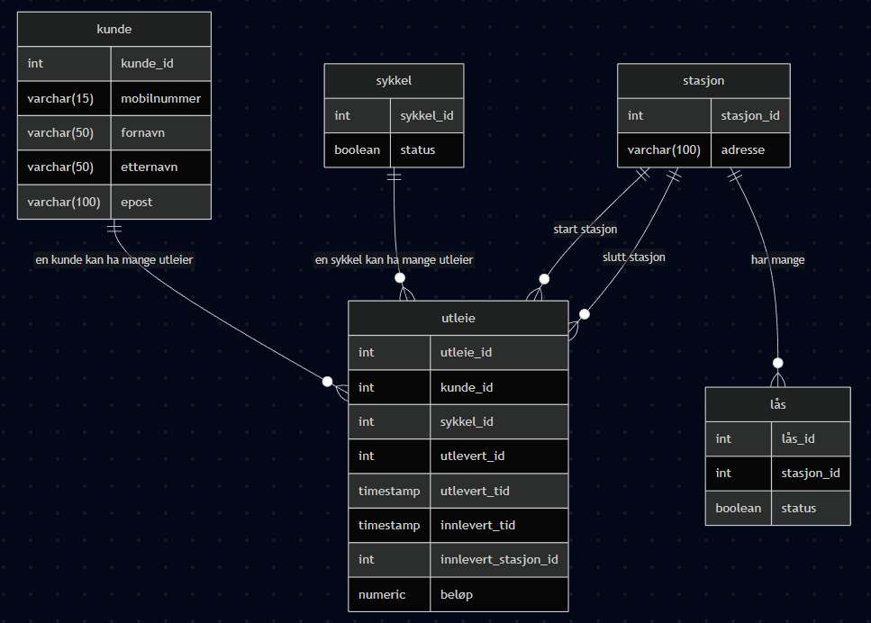
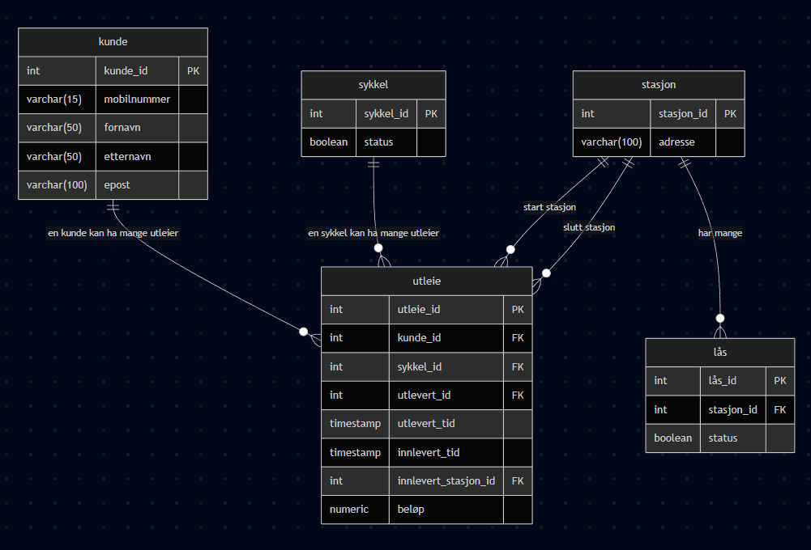

# Besvarelse - Refleksjon og Analyse

**Student:** Brede Overhalden

**Studentnummer:** brove3385

**Dato:** 01.03.26

---

## Del 1: Datamodellering

### Oppgave 1.1: Entiteter og attributter

**Identifiserte entiteter:**

Kunde, sykkel, stasjon, lås og utleie

**Attributter for hver entitet:**

Kunde: kunde_id, mobilnummmer, fornavn, etternavn og epost

Sykkel: sykkel_id, status

Stasjon: stasjon_id, adresse

Lås: lås_id, stasjon_id, status

Utleie: utleie_id, kunde_id, sykkel_id, utlevert_id, utlevert_tid, innlevert_tid, innlevert_stasjon_id, beløp

---

### Oppgave 1.2: Datatyper og `CHECK`-constraints

**Valgte datatyper og begrunnelser:**

`Kunde:`
int kunde_id, varchar(15) mobilnummer, varchar(50) fornavn, varchar(50) etternavn, varchar(100) epost.
Jeg har brukt varchar fordi teksten varierer i lengde fra kunde til kunde og int for id da det er
effektivt og egner seg for primær- og fremmednøkler.

`Sykkel:`
int sykkel_id, boolean status. Int for id da det er effektivt og egner seg for primær- og fremmednøkler.
Bruker boolean for status på sykkel fordi vi kun trenger to tilstander tilgjengelig (true) og ikke tilgjenglig (false)

`Stasjon:`
int stasjon_id, varchar(100) adresse. Jeg har brukt int for id fordi det er effektivt og egner seg som primær- og
fremmednøkkel. Bruker varchar for adresse fordi lengden varierer og feltet er tekst

`Lås:`
int lås_id, int stasjon_id, boolean status. Jeg har brukt int for ID-er fordi det er effektivt og egner seg som
primær- og fremmednøkler. Bruker boolean for status fordi vi kun trenger to tilstander låst (true) og åpen/ulåst (false)

`Utleie:`
int utleie_id, int kunde_id, int sykkel_id, int utlevert_id, timestamp utlevert_tid
timestamp innlevert_tid, int innlevert_stasjon_id, numeric(10,2) beløp. 
Bruker int for ID-er fordi det er effektivt og egner seg som primær- og fremmednøkler. Timestamp egner seg bra for ulevert
tid og innlevert tid fordi vi må måle tidsintervallet. Bruker numeric for beløp de dette gir presise bereginger av tall
satt 10 for totalt antall siffer og 2 for antall siffer etter komma. Numeric hindrer avrundingsfeil som kan skje ved bruk av float f.eks.

**`CHECK`-constraints:**
```
Kunde:
CHECK (mobilnummer ~ '^[0-9]{8,15}$') //Sikrer at mobilnummeret betår av kun tall og ikke er for kort/langt
CHECK (length(trim(fornavn)) > 0) //Hindrer at man lagrer tomme navn eller navn med bare mellomrom
CHECK (length(trim(etternavn)) > 0) //Hindrer at man lagrer tomme navn eller navn med bare mellomrom
CHECK (epost ~* '^[A-Z0-9._%+-]+@[A-Z0-9.-]+\.[A-Z]{2,}$') //Sikrer standard x@y.z epost format
```
```
Stasjon:
CHECK (length(trim(sted)) > 0) // Hindrer at stasjonen registreres uten adresse
```
```
Utleie:
CHECK (beløp IS NULL OR beløp >= 0) //Sikrer at beløpet ikke kan være negativ og NULL tillates før utleien er avsluttet
CHECK (innlevert_tid IS NULL OR innlevert_tid >= utlevert_tid) //Sikrer at en sykkel ikke leveres før den er hentet og NULL tilates så lenge det er aktivt utleie
CHECK (
  (innlevert_tid IS NULL AND innlevert_stasjon_id IS NULL)
  OR
  (innlevert_tid IS NOT NULL AND innlevert_stasjon_id IS NOT NULL)
) // Dette sikrer mot halvferdige utleier. Begge ID-er må enten være NULL eller satt 

```

**ER-diagram:**

---

### Oppgave 1.3: Primærnøkler

**Valgte primærnøkler og begrunnelser:**

Kunde:
Jeg har valgt å bruke en kunstig intern nøkkel som identifiserer hver kunde unikt. Mobilnummer og epost kan
endres over tid og er derfor ikke gunstige. En intern ID er derfor stabil og mer effektiv å bruke i relasjoner
fremmednøkler og spørringer

Sykkel:
Hver sykkel har en unik ID i systemet som nevnt i case beskivelsen. ```sykkel_id``` gjør det mulig å spore en spesifikk 
sykkel. Det gjør at vi kan se på utleier og historikk uavhengig av hvem som bruker den eller hvor den står.

Stasjon:
Stasjon trenger en unik identifikator for å kunne koble til låser og utleier. Addressen kan endres så en unik ID gir en
stabil og entydig nøkkel.

Lås:
Hver lås er et eget fysisk punkt på en satsjon og må kunne identifiseres unikt. ```lås_id``` brukes for å knytte låsen
til en bestemt stasjon ```stasjon_id```.

Utleie:
En utleie er en leieperiode, samme kunde kan leie samme sykkel mange ganger. Derfor trenger vi en unik ID for hver leie.
Med ```utleie_id``` kan vi referere til en spesifikk utleie.

**Naturlige vs. surrogatnøkler:**

I denne oppgaven har jeg valgt å bruke surrogatnøkler som primærnøkler for alle entiteter. Forskjellen mellom naturlig nøkkel
surrogatnøkkel er med en naturlig nøkkel så så bruker man en nøkkel som allerede finnes naturlig i dataene som f.eks. mobilnummer, 
epost, adresse osv. Med en surrogatnøkkel så bruker man en kunstig genereret ID som kun brukes for å identifisere rader i databasen.
Hvorfor har jeg valgt å bruke surrogatnøkler, det er fordi de gir stabilitet naturlige nøkler kan endres. En kunde kan bytte
mobilnummer, endre epost eller en stasjon kan endre adresse. En primærnøkkel bør helst aldri endres og det er derfor tryggere
med surrogatnøkler. Det gir også fleksibilitet hvis en kunde skulle ha flere eposter, flere mobilnummer eller stasjonen endrer
lokasjon da slipper vi å måtte endre på hele nøkkelstrukturen


**Oppdatert ER-diagram:**


---

### Oppgave 1.4: Forhold og fremmednøkler

**Identifiserte forhold og kardinalitet:**

[Skriv ditt svar her - list opp alle forholdene mellom entitetene og angi kardinalitet]

**Fremmednøkler:**

[Skriv ditt svar her - list opp alle fremmednøklene og forklar hvordan de implementerer forholdene]

**Oppdatert ER-diagram:**



---

### Oppgave 1.5: Normalisering

**Vurdering av 1. normalform (1NF):**

[Skriv ditt svar her - forklar om datamodellen din tilfredsstiller 1NF og hvorfor]

**Vurdering av 2. normalform (2NF):**

[Skriv ditt svar her - forklar om datamodellen din tilfredsstiller 2NF og hvorfor]

**Vurdering av 3. normalform (3NF):**

[Skriv ditt svar her - forklar om datamodellen din tilfredsstiller 3NF og hvorfor]

**Eventuelle justeringer:**

[Skriv ditt svar her - hvis modellen ikke var på 3NF, forklar hvilke justeringer du har gjort]

---

## Del 2: Database-implementering

### Oppgave 2.1: SQL-skript for database-initialisering

**Plassering av SQL-skript:**

[Bekreft at du har lagt SQL-skriptet i `init-scripts/01-init-database.sql`]

**Antall testdata:**

- Kunder: [antall]
- Sykler: [antall]
- Sykkelstasjoner: [antall]
- Låser: [antall]
- Utleier: [antall]

---

### Oppgave 2.2: Kjøre initialiseringsskriptet

**Dokumentasjon av vellykket kjøring:**

[Skriv ditt svar her - f.eks. skjermbilder eller output fra terminalen som viser at databasen ble opprettet uten feil]

**Spørring mot systemkatalogen:**

```sql
SELECT table_name 
FROM information_schema.tables 
WHERE table_schema = 'public' 
  AND table_type = 'BASE TABLE'
ORDER BY table_name;
```

**Resultat:**

```
[Skriv resultatet av spørringen her - list opp alle tabellene som ble opprettet]
```

---

## Del 3: Tilgangskontroll

### Oppgave 3.1: Roller og brukere

**SQL for å opprette rolle:**

```sql
[Skriv din SQL-kode for å opprette rollen 'kunde' her]
```

**SQL for å opprette bruker:**

```sql
[Skriv din SQL-kode for å opprette brukeren 'kunde_1' her]
```

**SQL for å tildele rettigheter:**

```sql
[Skriv din SQL-kode for å tildele rettigheter til rollen her]
```

---

### Oppgave 3.2: Begrenset visning for kunder

**SQL for VIEW:**

```sql
[Skriv din SQL-kode for VIEW her]
```

**Ulempe med VIEW vs. POLICIES:**

[Skriv ditt svar her - diskuter minst én ulempe med å bruke VIEW for autorisasjon sammenlignet med POLICIES]

---

## Del 4: Analyse og Refleksjon

### Oppgave 4.1: Lagringskapasitet

**Gitte tall for utleierate:**

- Høysesong (mai-september): 20000 utleier/måned
- Mellomsesong (mars, april, oktober, november): 5000 utleier/måned
- Lavsesong (desember-februar): 500 utleier/måned

**Totalt antall utleier per år:**

[Skriv din utregning her]

**Estimat for lagringskapasitet:**

[Skriv din utregning her - vis hvordan du har beregnet lagringskapasiteten for hver tabell]

**Totalt for første år:**

[Skriv ditt estimat her]

---

### Oppgave 4.2: Flat fil vs. relasjonsdatabase

**Analyse av CSV-filen (`data/utleier.csv`):**

**Problem 1: Redundans**

[Skriv ditt svar her - gi konkrete eksempler fra CSV-filen som viser redundans]

**Problem 2: Inkonsistens**

[Skriv ditt svar her - forklar hvordan redundans kan føre til inkonsistens med eksempler]

**Problem 3: Oppdateringsanomalier**

[Skriv ditt svar her - diskuter slette-, innsettings- og oppdateringsanomalier]

**Fordeler med en indeks:**

[Skriv ditt svar her - forklar hvorfor en indeks ville gjort spørringen mer effektiv]

**Case 1: Indeks passer i RAM**

[Skriv ditt svar her - forklar hvordan indeksen fungerer når den passer i minnet]

**Case 2: Indeks passer ikke i RAM**

[Skriv ditt svar her - forklar hvordan flettesortering kan brukes]

**Datastrukturer i DBMS:**

[Skriv ditt svar her - diskuter B+-tre og hash-indekser]

---

### Oppgave 4.3: Datastrukturer for logging

**Foreslått datastruktur:**

[Skriv ditt svar her - f.eks. heap-fil, LSM-tree, eller annen egnet datastruktur]

**Begrunnelse:**

**Skrive-operasjoner:**

[Skriv ditt svar her - forklar hvorfor datastrukturen er egnet for mange skrive-operasjoner]

**Lese-operasjoner:**

[Skriv ditt svar her - forklar hvordan datastrukturen håndterer sjeldne lese-operasjoner]

---

### Oppgave 4.4: Validering i flerlags-systemer

**Hvor bør validering gjøres:**

[Skriv ditt svar her - argumenter for validering i ett eller flere lag]

**Validering i nettleseren:**

[Skriv ditt svar her - diskuter fordeler og ulemper]

**Validering i applikasjonslaget:**

[Skriv ditt svar her - diskuter fordeler og ulemper]

**Validering i databasen:**

[Skriv ditt svar her - diskuter fordeler og ulemper]

**Konklusjon:**

[Skriv ditt svar her - oppsummer hvor validering bør gjøres og hvorfor]

---

### Oppgave 4.5: Refleksjon over læringsutbytte

**Hva har du lært så langt i emnet:**

[Skriv din refleksjon her - diskuter sentrale konsepter du har lært]

**Hvordan har denne oppgaven bidratt til å oppnå læringsmålene:**

[Skriv din refleksjon her - koble oppgaven til læringsmålene i emnet]

Se oversikt over læringsmålene i en PDF-fil i Canvas https://oslomet.instructure.com/courses/33293/files/folder/Plan%20v%C3%A5ren%202026?preview=4370886

**Hva var mest utfordrende:**

[Skriv din refleksjon her - diskuter hvilke deler av oppgaven som var mest krevende]

**Hva har du lært om databasedesign:**

[Skriv din refleksjon her - reflekter over prosessen med å designe en database fra bunnen av]

---

## Del 5: SQL-spørringer og Automatisk Testing

**Plassering av SQL-spørringer:**

[Bekreft at du har lagt SQL-spørringene i `test-scripts/queries.sql`]


**Eventuelle feil og rettelser:**

[Skriv ditt svar her - hvis noen tester feilet, forklar hva som var feil og hvordan du rettet det]

---

## Del 6: Bonusoppgaver (Valgfri)

### Oppgave 6.1: Trigger for lagerbeholdning

**SQL for trigger:**

```sql
[Skriv din SQL-kode for trigger her, hvis du har løst denne oppgaven]
```

**Forklaring:**

[Skriv ditt svar her - forklar hvordan triggeren fungerer]

**Testing:**

[Skriv ditt svar her - vis hvordan du har testet at triggeren fungerer som forventet]

---

### Oppgave 6.2: Presentasjon

**Lenke til presentasjon:**

[Legg inn lenke til video eller presentasjonsfiler her, hvis du har løst denne oppgaven]

**Hovedpunkter i presentasjonen:**

[Skriv ditt svar her - oppsummer de viktigste punktene du dekket i presentasjonen]

---

**Slutt på besvarelse**
